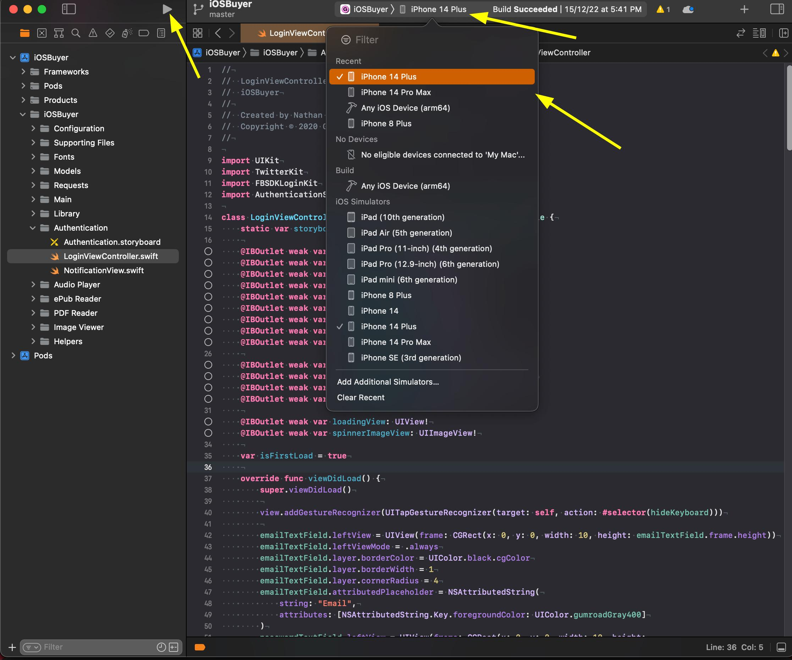

# Gumroad iOS app

This is an iOS app that allows our users to both view sales data and charts as a creator, and also consume the content they buy on Gumroad.
Audio, video, PDF and ePub files are viewable in the app. All other content can be shared to other apps or downloaded.

## Local development

### Prerequisites

1. We use [CocoaPods](https://cocoapods.org/) as a dependency manager. Install it as

```sh
gem install cocoapods
```

2. Once CocoaPods is installed, install the dependencies using

```sh
pod install
```

3. **Set up credentials** - Copy the example credential files and populate with real values:

```sh
cp Credentials/Development.xcconfig.example Credentials/Development.xcconfig
cp Credentials/Production.xcconfig.example Credentials/Production.xcconfig
cp Credentials/Staging.xcconfig.example Credentials/Staging.xcconfig
```

### Building the app and opening it in a simulator

1. Always open the Xcode workspace of the project instead of the project file.

```sh
open Gumroad.xcworkspace
```

If you are on Apple silicon, run Xcode using Rosetta:

- Enable Rosetta from `Applications` → `Xcode` (right click) → `Get Info` → Enable `Open using Rosetta`
- If you cannot find the `Open using Rosetta` option in `Get Info`, enable `Product` → `Destination` → `Show All Run Destinations` in Xcode, then choose a Rosetta enabled iOS simulator from `Product` → `Destination`

2. Choose an iOS simulator and build + run the project as shown below.



You can also use `Cmd+R` shortcut to build + run the project.

### Connecting to the locally running [gumroad/web](https://github.com/gumroad/web) server

If the intended API is not yet deployed to production or staging, you can build the app to point to your locally running gumroad/web server on https://gumroad.dev.

To do so:

1. Get the `uid` and `secret` credentials from the [`development mobile oauth app` OAuth application](https://github.com/antiwork/gumroad/blob/main/db/seeds/030_staging/mobile_oauth_application.rb)

2. Encrypt them using the ROT13 cipher:

```sh
echo "credential-value-here" | tr 'A-Za-z' 'N-ZA-Mn-za-m'
```

3. Update the `OAUTH_CLIENT_ID` and `OAUTH_SECRET_ID` values in `Credentials/Development.xcconfig` with these encrypted credentials.

4. Fill in the other required credentials in the same file (see the example files for guidance).

Now you should be able to login in the app (in simulator) as any user registered in your locally running gumroad/web server.

### Credential Management

All sensitive credentials are centralized in the `Credentials/` directory:

- `Credentials/Development.xcconfig` - Development environment credentials
- `Credentials/Production.xcconfig` - Production environment credentials
- `Credentials/Staging.xcconfig` - Staging environment credentials

Example files (`.xcconfig.example`) are provided to show the required format. Copy these to create your actual credential files.

#### Google Services Configuration

The app requires a `GoogleService-Info.plist` file for Firebase and Google Services integration:

1. **Set up the configuration file**:
   ```sh
   cp "Gumroad/Supporting Files/GoogleService-Info.plist.example" "Gumroad/Supporting Files/GoogleService-Info.plist"
   ```

2. **Configure Firebase credentials**: Open the newly copied `GoogleService-Info.plist` file and replace the dummy placeholder values with your actual Firebase credentials.


### Connecting to staging and production environments

For information about connecting to staging and production environments, see the [Environment Connections Guide](./docs/ENVIRONMENT_CONNECTIONS.md).

## Deployment

For information about archiving builds, submitting to TestFlight, and releasing to the App Store, see the [Deployment Guide](./docs/DEPLOYMENT.md).
