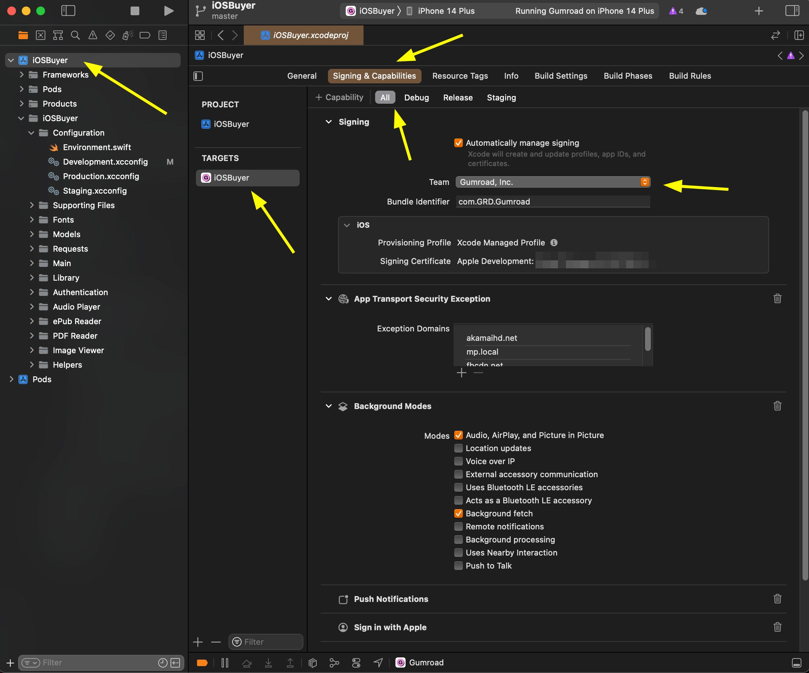
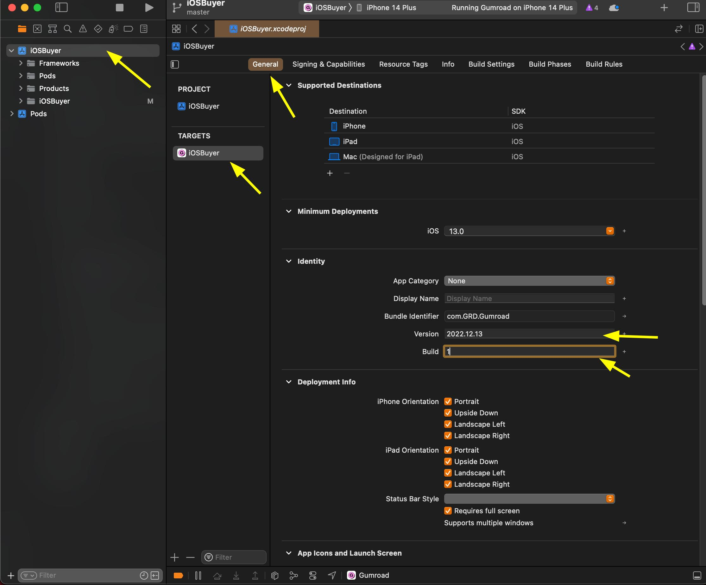
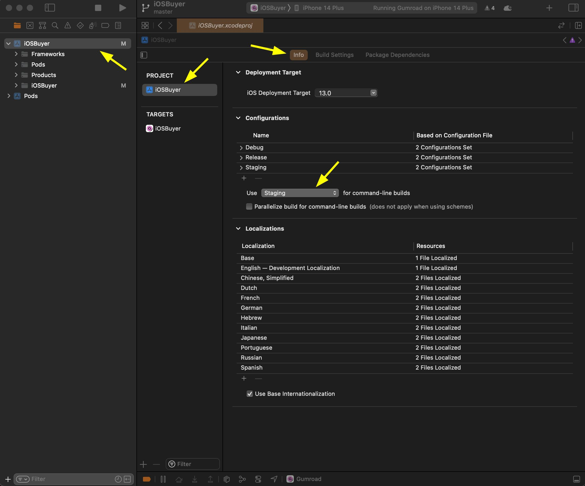
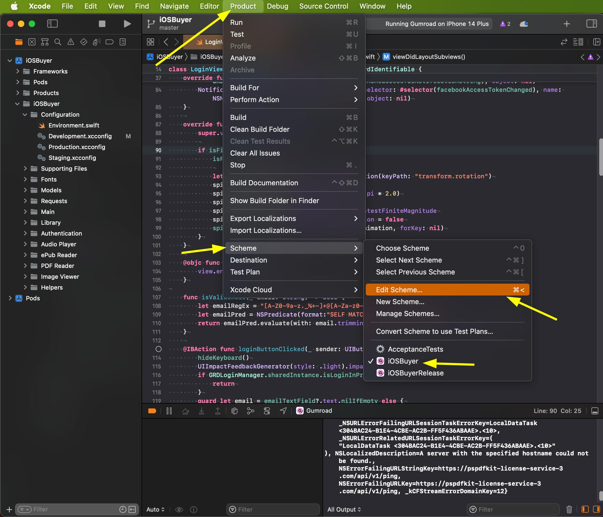
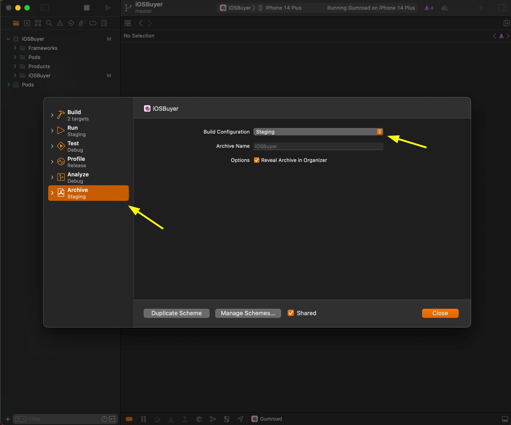
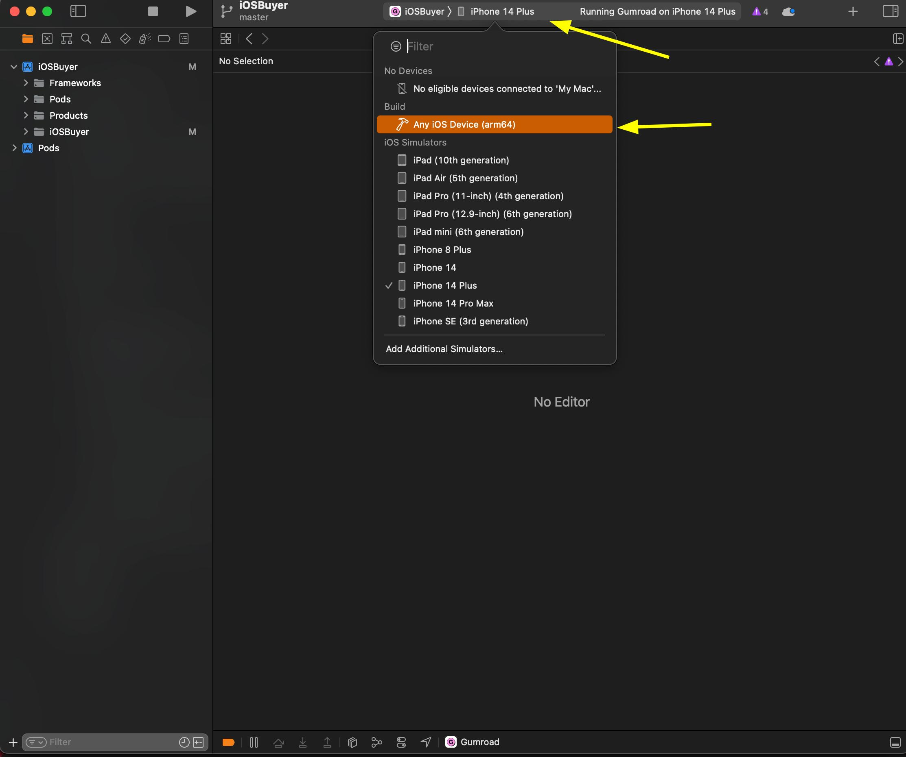
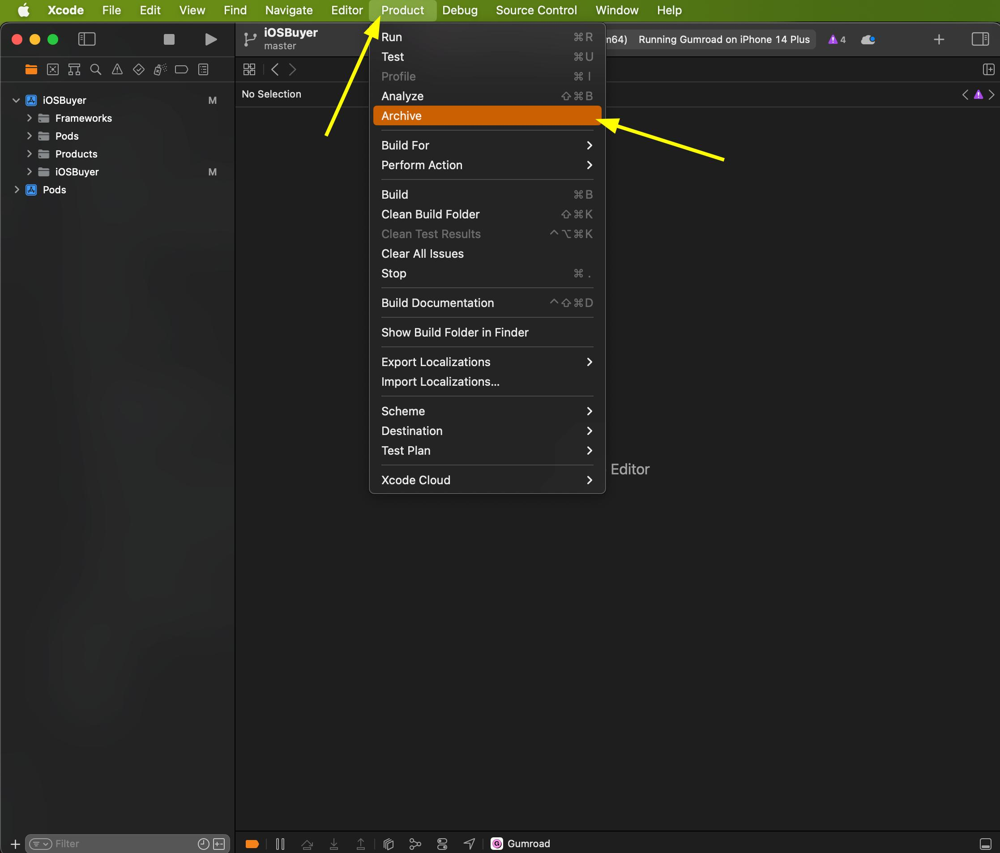
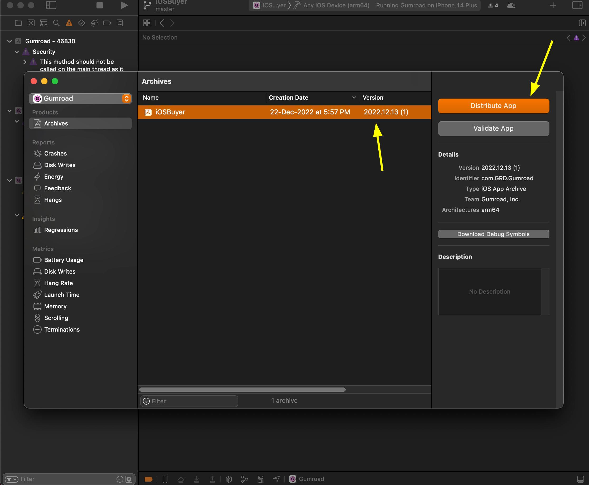
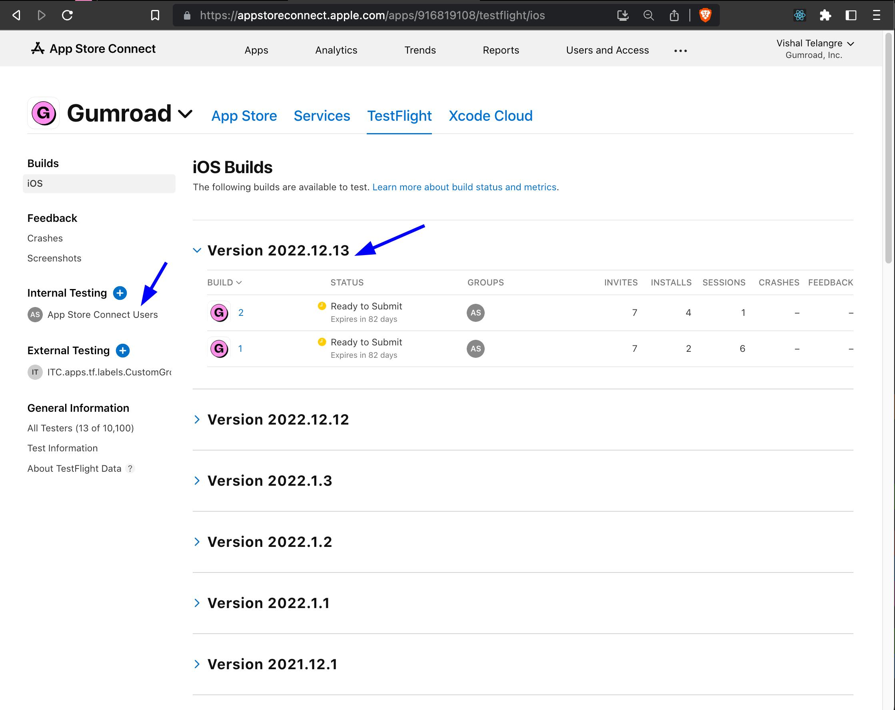
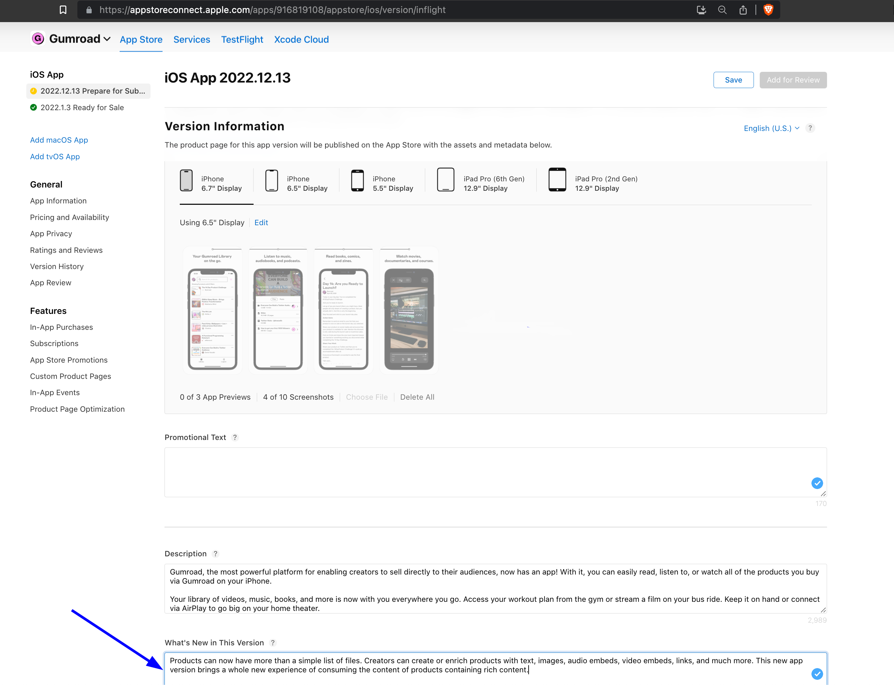

# Deployment Guide

This document covers the process for archiving builds, submitting to TestFlight, and releasing to the App Store.

## Archiving builds and submitting it to TestFlight

### Prerequisites

Once you are ready with your changes, you should submit a build with those changes to TestFlight so other team members can help you test it.

You must be a member of the Gumroad team on TestFlight to do so. Please ping Sahil in `#mobile-apps` Slack channel with your Apple ID so he can invite you to become a member of the Gumroad team.

Once you accept the invitation, select `Gumroad, Inc.` in the `Team` dropdown under the project's `Signing & Capabilities` settings.

### Versioning builds

Before archiving a build, we must first set a proper version.

We use "YYYY.MM.DD" format for versioning. The builds of the same version should have an incremented `Build` number.

### Archiving a build configured for the staging environment & submitting it to TestFlight

1. Set `Use "Staging" (configuration) for command-line builds` as follows.

    

2. Edit scheme and set the "Build configuration" to `Staging`  for the `Archive` operation.

    

    

3. Select `Any iOS device (arm64)` to build an archive. Xcode does not allow building an archive for a simulator.

    

4. Archive and then distribute it.

    

    

5. Follow the on-screen instructions and finally submit it to TestFlight.
6. After a while, it should start reflecting in the TestFlight web interface. Also, Apple should have already notified the users in the "Internal testing" group so they can test this build.

    

> **Note**
> Once the testing is finished, please revert the changes made to `Gumroad.xcodeproj/project.pbxproj` and `Gumroad.xcodeproj/xcshareddata/xcschemes/Gumroad.xcscheme` files. Do not check-in those changes.

### Archiving a build configured for the production environment & submitting it to TestFlight

Follow the same steps as above (of the staging environment) except set the configuration to `Release` in step 1 and 2 instead of `Staging`.

## Releasing a production build to App Store

Once you have successfully tested a production build in TestFlight, the same build can be submitted to the App Store for approval.

Please enter an appropriate copy for the `What's New in This Version` and click `Add for Review`.

It can take about a day or two for Apple to review and accept a submission. Once accepted, it can take up to another 24 hours for that released version to become publicly available in the App Store.
