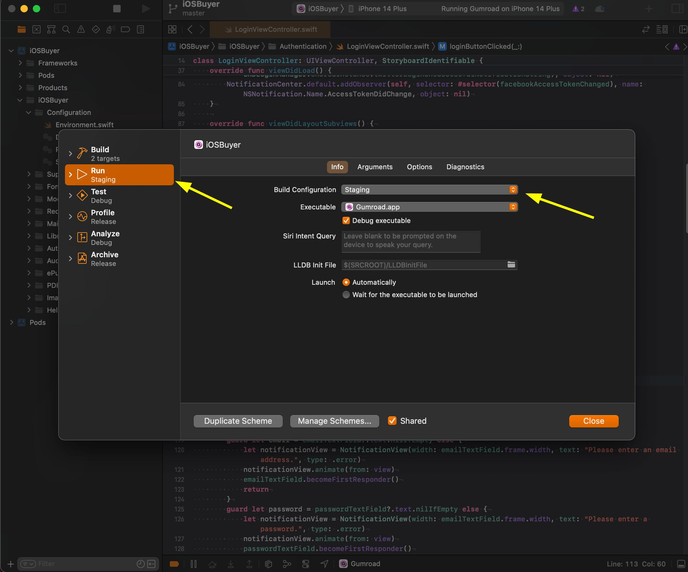

# Environment Connections

This guide explains how to configure the iOS app to connect to different environments: staging and production.

## Connecting to the staging environment

In order to build + run the app that points to the gumroad/web server's staging environment (running on https://app.staging.gumroad.com), edit the scheme in Xcode as follows.

Then set the "Build Configuration" to `Staging` for the `Run` operation.

Re-build + run the project and then it should allow you to login as any staging user in the simulator.

> **Note**
> Please revert the changes made to the `Gumroad.xcodeproj/xcshareddata/xcschemes/Gumroad.xcscheme` file whenever you edit the scheme. Do not check-in those changes.

## Connecting to the production environment

Similar to the staging environment, it's easy to point the app in simulator to the gumroad/web server's production environment (running on https://gumroad.com).

Edit the scheme and set the "Build Configuration" to `Release` for the `Run` operation.
